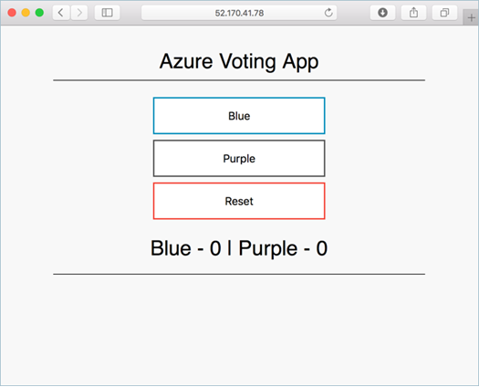

# 1. Kubernetes Workshop

This workshop/tutorial contains a number of different sections, each addressing a specific aspect of running workloads (containers) in Kubernetes, including how to design CI/CD pipelines.

You will go through the following steps to complete the workshop:

* Use Azure Portal and Azure Cloud Shell
* Setup Azure Container Registry to build and store docker images
* Create Kubernetes Cluster using AKS (Azure Kubernetes Service)
* Deploy application to Kubernetes
* Modify application and redeploy

# 2. Prerequisites

## 2.1 Subscription
You need a valid Azure subscription. If you do not have one, you can sign up for a free trial account here: <https://azure.microsoft.com/en-us/free/>

To use a specific subscription, use the ````account```` command like this (with your subscription id):
````
az account set --subscription <subscription-id>
````
If don't h ave a shell set up to run this command, there will be instructions further down to do that.

## 2.2. Azure Portal

To make sure you are correctly setup with a working subscription, make sure you can log in to the Azure portal. Go to <https://portal.azure.com> Once logged in, feel free to browse around a little bit to get to know the surroundings!

It might be a good idea to keep a tab with the Azure Portal open during the workshop, to keep track of the Azure resources you create. We will almost exclusively use CLI based tools during the workshop, but everything we do will be visible in the portal, and all the resources we create could also be created using the portal.

## 2.3. Azure Cloud Shell

We will use the Azure Cloud Shell (ACS) throughout the workshop for all our command line needs. This is a web based shell that has all the necessary tools (like kubectl, az cli, helm, etc) pre-installed.

Start cloud shell by typing the address ````shell.azure.com```` into a web browser. If you have not used cloud shell before, you will be asked to create a storage location for cloud shell. Accept that and make sure that you run bash as your shell (not powershell).

**Protip: You can use ctrl-c to copy text in cloud shell. To paste you have to use shift-insert, or use the right mouse button -> paste. If you are on a Mac, you can use the "normal" Cmd+C/Cmd+V.**

**Protip II: Cloud Shell will time out after 20 minutes of inactivity. When you log back in, you will end up in your home directory, so be sure to ````cd```` into where you are supposed to be.**

# 3. Hands-on Exercises 

## 3.1. Get the code

The code for this workshop is located in the same repository that you are looking at now. To *clone* the repository to your cloud shell, do this:

```bash
git clone https://github.com/pelithne/aks_workshop.git
```

Then cd into the repository directory:

````bash
cd aks_workshop
````

## 3.2. View the code

Azure Cloud Shell has a built in code editor, which is based on the popular VS Code editor. To view/edit all the files in the repository, run code like this:

Note: If you are asked to "downgrade" to classic, please do so.

````bash
code .
````

You can navigate the files in the repo in the left hand menu, and edit the files in the right hand window. Use the *right mouse button* to access the various commands (e.g. ````Save```` and ````Quit```` etc).

For instance, you may want to have a look in the ````application/azure-vote-app```` directory. This is where the code for the application is located. Here you can also find the *Dockerfile* which will be used to build your docker image, in a later step.

## 3.3. Create Resource Group

All resources in Azure exists in a *Resource Group*. The resource group is a "placeholder" for all the resources you create. 

All the resources you create in this workshop will use the same Resource Group. Use the commnd below to create the resource group.

If you are working in a shared subscription, make sure that you create a uniqely named resource group, eg by using your corporate signum.

````bash
az group create -n <resource-group-name> -l swedencentral
````

## 3.4. ACR - Azure Container Registry

You will use a private Azure Container Registry to *build* and *store* the docker images that you will deploy to Kubernetes. The name of the the ACR needs to be globally unique, and should consist of only lower case letters. You could for instance use your corporate signum.

The reason it needs to be unique, is that your ACR will get a Fully Qualified Domain Name (FQDN), on the form ````<Your unique ACR name>.azurecr.io````

The command below will create the container registry and place it in the Resource Group you created previously.

````bash
az acr create --name <your unique ACR name> --resource-group <resource-group-name> --sku basic --admin-enabled true
````

### 3.4.1. Build images using ACR

Docker images can be built in a number of different ways, for instance by using the docker CLI. Another (and easier!) way is to use *Azure Container Registry Tasks*, which is the approach we will use in this workshop.

The docker image is built using a so called *Dockerfile*. The Dockerfile contains instructions for how to build the image. Feel free to have a look at the Dockerfile in the repository (once again using *code*):

````bash
code application/azure-vote-app/Dockerfile
````

As you can see, this very basic Dockerfile will use a *base image* from ````tiangolo/uwsgi-nginx-flask:python3.6-alpine3.8````.

On top of that base image, it will install [redis-py](https://pypi.org/project/redis/) and then take the contents of the directory ````./azure-vote```` and copy it into the container in the path ````/app````.

To build the docker container image, cd into the right directory, and use the ````az acr build```` command:

````bash
cd application/azure-vote-app
az acr build --image azure-vote-front:v1 --registry <your unique ACR name> --file Dockerfile .
````

### 3.4.2. List images in registry

To return a list of images that have been built, use the ```az acr repository list``` command:

```azurecli
az acr repository list --name <your unique ACR name> --output table
```

This image will be deployed from ACR to a Kubernetes cluster in the next step.

## 3.5. AKS - Azure Kubernetes Service

AKS is the hosted Kubernetes service on Azure.

Kubernetes provides a distributed platform for containerized applications. You build and deploy your own applications and services into a Kubernetes cluster, and let the cluster manage the availability and connectivity. In this step a sample application will be deployed into your own Kubernetes cluster. You will learn how to:

* Create an AKS Kubernetes Cluster
* Connect/validate towards the AKS Cluster
* Update Kubernetes manifest files
* Run an application in Kubernetes
* Test the application

### 3.5.1. Create Kubernetes Cluster

### Note: you may need a special command to create your cluster. Ask you coach for guidance


Create an AKS cluster using ````az aks create````. Make sure to attach the Azure Container Registry created in a previous step, using the ````attach-acr flag````. Lets give the cluster the name  ````k8s````, and run the command:

```azurecli
az aks create --resource-group <resource-group-name> --name k8s --node-count 1 --node-vm-size Standard_D2s_v4 --attach-acr <your unique ACR name> --enable-cluster-autoscaler --min-count 1 --max-count 10 --generate-ssh-keys
```

The creation time for the cluster can be up to 10 minutes, so this might be a good time for a leg stretcher and/or cup of coffee!

### 3.5.2. Validate towards Kubernetes Cluster

In order to use `kubectl` you need to connect to the Kubernetes cluster, using the following command (which assumes that you have used the naming proposals above):

```azurecli
az aks get-credentials --resource-group <resource-group-name> --name k8s
```

To verify that your cluster is up and running you can try a kubectl command, like ````kubectl get nodes```` which  will show you the nodes (virtual machines) that are active in your cluster.

````bash
kubectl get nodes
````

### 3.6. Deploy the application

To deploy your application, you first need to change the application manifest to use the container image you built in a previous step. Open up the manifest with **code** like this

````code manifests/deployment.yaml````

Look for a line that looks like this:
````image: mcr.microsoft.com/azuredocs/azure-vote-front````

And replace the line with a URL corresponding to your own container registry. It will look similar to this:
````image: <your unique ACR name>.azurecr.io/azure-vote-front:v1````


To deploy your application, use the ```kubectl apply``` command. This command parses the manifest file and creates the needed Kubernetes objects. The following commands first deploy the services, and then the deployments (with the actual pods):

```console
kubectl apply -f manifests/deployment.yaml
kubectl apply -f manifests/service.yaml
```

When the manifests have applied, two pods and two services are created. The pods contains the "business logic" of your application and the services expose the application to the internet (and internally in AKS). This process can take a few minutes, in part because the container image needs to be downloaded from ACR to the Kubernetes Cluster. 

To monitor the progress of the download, you can use ``kubectl get pods`` and ``kubectl describe pod``, like this:

First use ``kubectl get pods`` to find the name of your pod:

```bash
kubectl get pods
```

Then use ``kubectl describe pod`` with the name of your pod:

```bash
kubectl describe pod <pod name>
```

You can also use ``kubectl describe`` to troubleshoot any problems you might have with the deployment (for instance, a common problem is **Error: ErrImagePull**, which can be caused by incorrect credentials or incorrect address/path to the container in ACR. It can also happen if the Kubernetes Cluster does not have read permission in the Azure Container Registry.

Once your container has been pulled and started, showing state **READY**, you can instead start monitoring the **service** to see when a public IP address has been created.

To monitor progress, use the `kubectl get service`. You will probably have to repeats a few times, as it can take a while to get the public IP address.

```console
kubectl get service azure-vote-front
```

The *EXTERNAL-IP* for the *azure-vote-front* service initially appears as *pending*, as shown in the following example:

```bash
azure-vote-front   10.0.34.242   <pending>     80:30676/TCP   7s
```

When the *EXTERNAL-IP* address changes from *pending* to an actual public IP address, the creation of the service is finished. The following example shows a public IP address is now assigned:

```bash
azure-vote-front   10.0.34.242   52.179.23.131   80:30676/TCP   2m
```

To see the application in action, open a web browser to the external IP address.


### 3.6.1. Update an application in Azure Kubernetes Service (AKS)

After an application has been deployed in Kubernetes, it can be updated by specifying a new container image or image version. When doing so, the update is staged so that only a portion of the deployment is concurrently updated. This staged update enables the application to keep running during the update. It also provides a rollback mechanism if a deployment failure occurs.

In this step the sample Azure Vote app is updated. You learn how to:

* Update the front-end application code
* Create an updated container image
* Deploy the updated container image to AKS


The sample application source code can be found inside of the *azure-vote* directory. Open the *config_file.cfg* file with an editor, such as `code`:

```bash
code application/azure-vote-app/azure-vote/config_file.cfg
```

Change the values for *VOTE1VALUE* and *VOTE2VALUE* to different colors. The following example shows the updated color values:

```bash
# UI Configurations
TITLE = 'Azure Voting App'
VOTE1VALUE = 'Blue'
VOTE2VALUE = 'Purple'
SHOWHOST = 'false'
```

Save and close the file.

### 3.6.2. Update the container image

To build a new front-end image, use ```az acr build``` the same way as before, but make sure to change the version from ````v1```` to ````v2````


First cd into the application directory again.
````
cd application/azure-vote-app
````

```bash
az acr build --image azure-vote-front:v2 --registry <your unique ACR name> --file Dockerfile .
```

This will build a new container image, with the code changes you did in the previous step. The image will be stored in ACR with the same name as before, but with a new version (v2).

You can check that all went well with the ````az acr repository show-tags```` command:

````bash
az acr repository show-tags --name <Your ACR Name> --repository azure-vote-front --output table
````

### 3.6.3. Deploy the updated application

To update the application, you can use  ```kubectl set``` and specify the new application version, but the preferred way is to edit the kubernetes manifest to change the version.

Note: First make sure you are in the base directory of the repo ````aks_basics````

Open the file ````manifests/deployment.yaml```` again and change the version of the ````image:```` from ````<Your ACR Name>.azurecr.io/azure-vote-front:v1```` to ````<Your ACR Name>.azurecr.io/azure-vote-front:v2````

Change

```yaml
    spec:
      containers:
      - name: azure-vote-front
        image: <Your ACR Name>.azurecr.io/azure-vote-front:v1
```

To

```yaml
    spec:
      containers:
      - name: azure-vote-front
        image: <Your ACR Name>.azurecr.io/azure-vote-front:v2
```

And then run:

````bash
kubectl apply -f manifests/deployment.yaml
````

Note in the output of the command, how only the azure-vote-front deployment is *configured* while the others are *unchanged*. This is because the changes made to the manifest only impacts the azure-vote-front deployment. In other words, only the necessary things are changed, while the rest is left untouched.

````bash
deployment.apps/azure-vote-back unchanged
service/azure-vote-back unchanged
deployment.apps/azure-vote-front configured
service/azure-vote-front unchanged
````

To monitor the deployment, use the ```kubectl get pods``` command. As the updated application is deployed, your pods are terminated and re-created with the new container image.

```bash
kubectl get pods
```

The following example output shows pods terminating and new instances running as the deployment progresses:

```bash
kubectl get pods

NAME                               READY     STATUS        RESTARTS   AGE
azure-vote-back-2978095810-gq9g0   1/1       Running       0          5m
azure-vote-front-1297194256-tpjlg  1/1       Running       0          1m
azure-vote-front-1297194256-zktw9  1/1       Terminating   0          1m
```

### 3.6.4. Test the updated application

To view the updated application, first get the external IP address of the `azure-vote-front` service (will be the same as before, since the service was not updated, only the pod):

```console
kubectl get service azure-vote-front
```

Now open a local web browser to the IP address.



### 3.7. Clean-up

Make sure the application is deleted from the cluster

````bash
kubectl delete -f manifests/deployment.yaml
kubectl delete -f manifests/service.yaml
````
