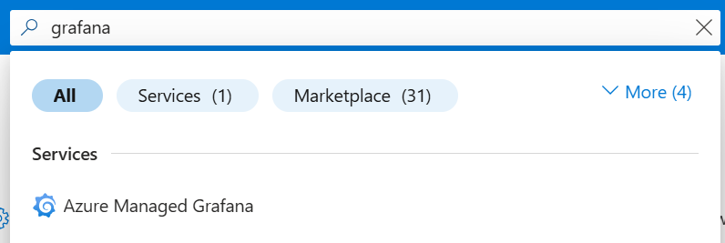
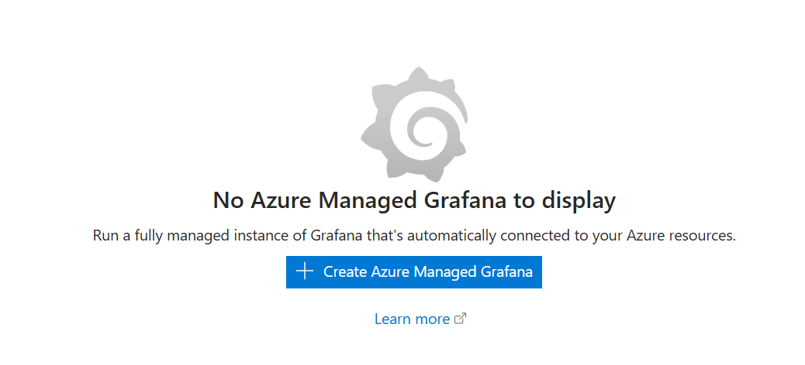

## Using Azure Monitor with Managed Prometheus, Grafana, and Container Insights


In this section you will be using Azure Monitor with managed Prometheus, Grafana, and Container Insights. By the end of this tutorial, you will have a basic understanding of how to monitor your AKS cluster using these tools.


### Objectives
Enable Container Insights
Enable managed Prometheus and MAnaged Grafana
Create and view dashboards


### Introduction
This section describes how to enable complete monitoring of your Kubernetes clusters using the following Azure Monitor features:

* Managed Prometheus for metric collection
* Container insights for log collection
* Managed Grafana for visualization.


Using the Azure portal, you can enable all of the features at the same time. You can also enable them individually by using the Azure CLI, Azure Resource Manager template, Terraform, or Azure Policy. In these instructions, we use the azure CLI.

#### Add metrics add-on to scrape Prometheus metrics

Use the ````--enable-azure-monitor-metrics```` option for ````az aks update````  to install the metrics add-on that scrapes Prometheus metrics. 


````
az aks update --enable-azure-monitor-metrics --name <cluster-name> --resource-group <cluster-resource-group>
````
 
This will install a number of pods in your kubernetes cluster, with names similar to ````ama-metrics-85c8894994-lkp5d ```` which are responsible for scraping metrics from the AKS applications and infrastructure, and forwarding it to Azure Monitor. The command also installs the retina-agent, which you can read more about here: https://github.com/microsoft/retina

You can check this using ````kubectl get pods```` and look specifically for pods in the ````kube-system```` namespace. 

````
kubectl get pods -n kube-system
````

This should give an output similar to this (note how some pods are "younger" than the others)

````
NAME                                            READY   STATUS    RESTARTS      AGE
ama-metrics-85c8894994-lkp5d                    2/2     Running   0             63s
ama-metrics-85c8894994-rfc8k                    2/2     Running   0             63s
ama-metrics-ksm-5bd68b9c-m9fjj                  1/1     Running   0             63s
ama-metrics-node-qgpb5                          2/2     Running   0             63s
ama-metrics-operator-targets-79cd8c5446-j59n6   2/2     Running   2 (54s ago)   63s
azure-cns-pf265                                 1/1     Running   0             32m
azure-ip-masq-agent-rfqz5                       1/1     Running   0             32m
azure-policy-64fb7f857b-gcwg5                   1/1     Running   0             23m
azure-policy-webhook-5bc64ff56d-dh7xw           1/1     Running   0             23m
cloud-node-manager-vb5j8                        1/1     Running   0             32m
coredns-659fcb469c-hhzzm                        1/1     Running   0             33m
coredns-659fcb469c-mcjgd                        1/1     Running   0             32m
coredns-autoscaler-bfcb7c74c-sq9bd              1/1     Running   0             33m
csi-azuredisk-node-z4h5v                        3/3     Running   0             32m
csi-azurefile-node-w7kfq                        3/3     Running   0             32m
konnectivity-agent-5d8cb46ff4-p46gw             1/1     Running   0             12m
konnectivity-agent-5d8cb46ff4-qlxk5             1/1     Running   0             12m
kube-proxy-gwl7x                                1/1     Running   0             32m
metrics-server-5dfc656944-hn9nv                 2/2     Running   0             32m
metrics-server-5dfc656944-jfd9n                 2/2     Running   0             32m
retina-agent-qdhdw                              0/1     Running   0             55s

````


Next, enable **Container Insights**


#### Note: this might take a few minutes. Take a leg stretcher or a cup of coffee!
````
az aks enable-addons --addon monitoring --name <cluster-name> --resource-group <cluster-resource-group-name>
````
This will install pods with names similar to ````ama-logs-7mckv ```` and ````ama-logs-rs-554fbb5967-nj8hx````. These pods are responsible for gathering log data from various Kubernetes components, including applications, containers, and system logs. They also forward the logs to Azure Monitor.

You can check this using ````kubectl get pods```` in ````kube-system```` and grep for ````ama-logs```` to see the newly created pods. 

````
kubectl get pods -n kube-system |grep "ama-logs"
````

This should give an output similar to this

````
ama-logs-7mckv                                  3/3     Running   0             76s
ama-logs-7vl5j                                  3/3     Running   0             35s
ama-logs-rs-554fbb5967-nj8hx                    2/2     Running   0             76s
````


#### Create a Grafana dashboard

Now that we have create the log and metrics collection, we can go ahead and create a grafana dashboard. 

In the search field in the Azure Portal, write **grafana**. In your search results, you should see **Azure Managed Grafana**



When you click on **Azure Managed Grafana** you will be presented with the option to create a managed grafana instance. 




Click on **Create Azure Managed Grafana**

Now, you need to configure your Grafana, just like when creating any Azure resource with the portal. You only have to care about the **Basics**

| Property           | Value                                                                |
|--------------------|----------------------------------------------------------------------|
| Subscription       | Use the subscription that you received for this workshop             |
| Resource group name| Use the one you created earlier for the AKS cluster                  |
| Location           | Sweden Central                                                       |
| Name               | Globally unique name (for example based on your corporate signum)    |
| Pricing Plan       | Standard                                                             |
| Grafana Version    | 10     

The select **Create** and after validation click on the **Create** button.


In Grafana, go to Dashboards > New Dashboard.
Add a new panel and select Prometheus as the data source.
Create visualizations based on your metrics.

#### Create a CPU Usage Dashboard

Create a new dashboard in Grafana.
Add a panel to display CPU usage metrics from Prometheus.


#### Monitor Pod Memory Usage

Add another panel to your dashboard to monitor memory usage of pods.
